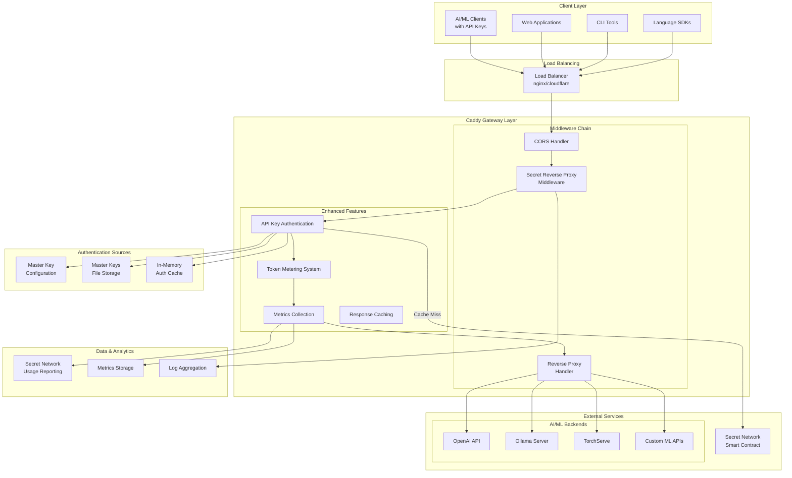
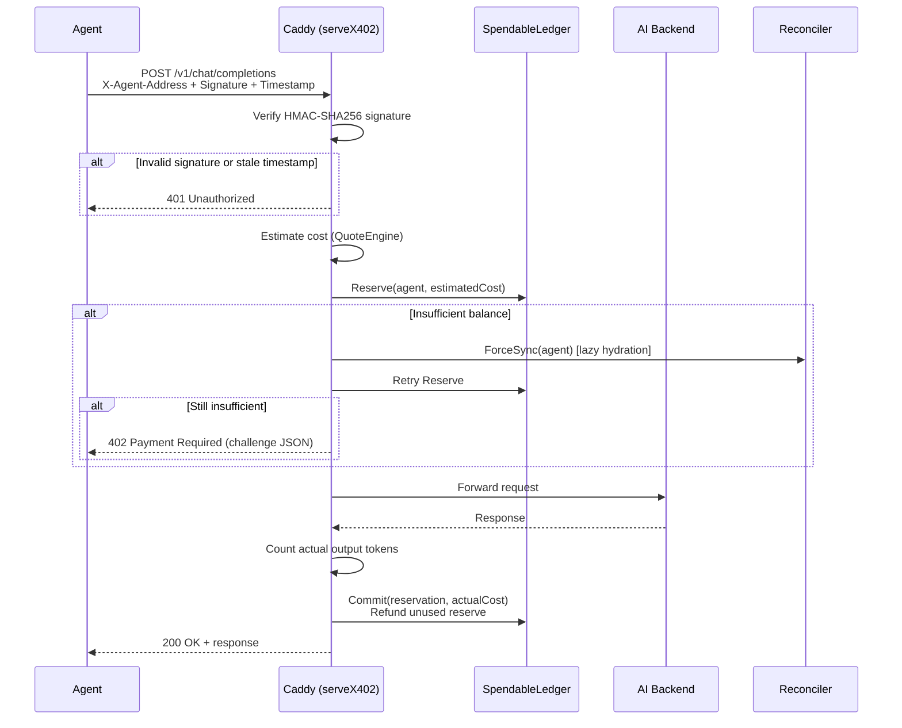
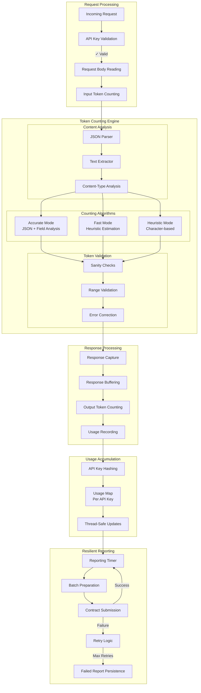
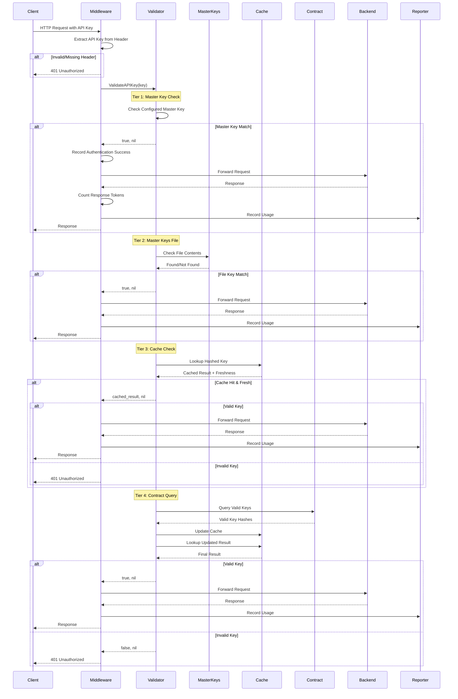
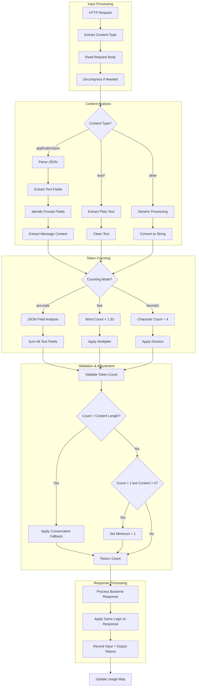
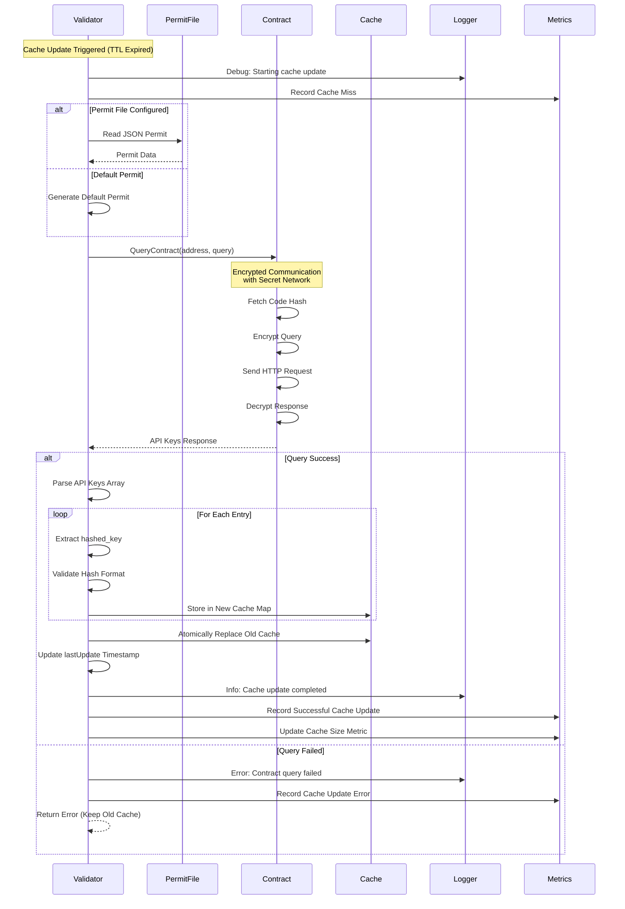

# Secret AI Caddy - Architecture Documentation

## Overview

The Secret AI Caddy is a comprehensive Caddy middleware that provides secure API key authentication, intelligent token usage metering, and comprehensive metrics collection for AI/ML API gateways. It validates API keys against multiple sources including local master keys, file-based keys, and Secret Network smart contracts with performance-optimized caching.

## High-Level Architecture



## Core Module Architecture

```mermaid
classDiagram
    class Middleware {
        -config: *Config
        -validator: *APIKeyValidator
        -quitChan: chan struct
        -meteringRunning: bool
        -tokenCounter: TokenCounter
        -bodyHandler: BodyHandler
        -tokenAccumulator: *TokenAccumulator
        -resilientReporter: *ResilientReporter
        -metricsCollector: MetricsCollector
        -authVerifier: *x402.AuthVerifierImpl
        -quoteEngine: *x402.QuoteEngineImpl
        -ledger: *x402.LedgerImpl
        -settlementEngine: *x402.SettlementEngineImpl
        -challengeBuilder: *x402.ChallengeBuilderImpl
        -secretVMClient: *x402.SecretVMClientImpl
        -reconciler: *x402.ReconcilerImpl
        +CaddyModule() ModuleInfo
        +Provision(ctx: Context) error
        +Validate() error
        +ServeHTTP(w, r, next) error
        +UnmarshalCaddyfile(d) error
        +Cleanup() error
        -serveX402(w, r, next) error
    }
    
    class Config {
        +APIKey: string
        +MasterKeysFile: string
        +PermitFile: string
        +ContractAddress: string
        +SecretNode: string
        +SecretChainID: string
        +CacheTTL: Duration
        +Metering: bool
        +MeteringInterval: Duration
        +MeteringURL: string
        +MaxBodySize: int64
        +TokenCountingMode: string
        +MaxRetries: int
        +RetryBackoff: Duration
        +EnableMetrics: bool
        +MetricsPath: string
    }
    
    class APIKeyValidator {
        -config: *Config
        -cache: map[string]bool
        -cacheMutex: RWMutex
        -lastUpdate: Time
        +ValidateAPIKey(key: string) (bool, error)
        +CheckMasterKeys(key: string) (bool, error)
        +UpdateAPIKeyCache() error
        +CleanupCache()
        +CacheSize() int
        +LastUpdate() Time
    }
    
    class TokenCounter {
        -logger: *Logger
        +CountTokens(content, contentType: string) int
        +ValidateTokenCount(tokens, contentLength: int) int
        -countJSONTokens(content: string) int
        -countTextTokens(text: string) int
        -extractTextFromJSON(data: interface{}) []string
    }
    
    class BodyHandler {
        -maxBodySize: int64
        -maxBufferSize: int64
        -logger: *Logger
        -compressionEnabled: bool
        -bufferPool: *sync.Pool
        +SafeReadRequestBody(r: *Request) (*RequestBodyInfo, error)
        +GetContentType(r: *Request) string
        +IsTokenCountableContent(contentType: string) bool
        +ValidateRequestSize(r: *Request) error
    }
    
    class TokenAccumulator {
        -mu: Mutex
        -usage: map[string]*TokenUsage
        +RecordUsage(apiKeyHash: string, input, output: int)
        +FlushUsage() map[string]TokenUsage
        +PeekUsage() map[string]TokenUsage
    }
    
    class ResilientReporter {
        -config: *Config
        -accumulator: *TokenAccumulator
        -logger: *Logger
        -failedReportsDir: string
        -maxRetries: int
        -retryBackoff: Duration
        -stopChan: chan struct
        -running: bool
        +StartReportingLoop(interval: Duration)
        +Stop()
        +GetFailedReportsCount() int
        -processCurrentUsage()
        -submitWithRetry(records: []map, attempt: int) error
        -persistFailedReport(records: []map)
    }
    
    class MetricsCollector {
        -config: Config
        -mu: RWMutex
        -requestCount: int64
        -authorizedCount: int64
        -rejectedCount: int64
        -totalInputTokens: int64
        -totalOutputTokens: int64
        -startTime: Time
        +RecordRequest()
        +RecordAuthorized()
        +RecordRejected()
        +RecordTokens(input, output: int64)
        +GetMetrics() map[string]any
        +ServeMetrics(w: ResponseWriter, r: *Request)
    }
    
    class QueryContract {
        +QueryContract(address: string, query: map) (map, error)
        +NewWASMContext(context: map) *WASMContext
        +fetchCodeHash(address: string) (string, error)
    }
    
    class WASMContext {
        -cliContext: map[string]string
        -testKeyPairPath: string
        -nonce: []byte
        +Encrypt(data: []byte) ([]byte, error)
        +Decrypt(data: []byte) ([]byte, error)
        -getTxSenderKeyPair() ([]byte, []byte, error)
        -getConsensusIOPubKey() ([]byte, error)
        -getTxEncryptionKey(privKey: []byte) ([]byte, error)
    }
    
    Middleware --> Config
    Middleware --> APIKeyValidator
    Middleware --> TokenCounter
    Middleware --> BodyHandler
    Middleware --> TokenAccumulator
    Middleware --> ResilientReporter
    Middleware --> MetricsCollector
    APIKeyValidator --> Config
    APIKeyValidator --> QueryContract
    ResilientReporter --> TokenAccumulator
    QueryContract --> WASMContext
```

## x402 Payment Protocol Architecture

The x402 subsystem adds prepaid metering and payment enforcement for AI agent requests. It runs as a parallel authentication path — requests with `X-Agent-Address` headers take the x402 path; all other requests use legacy API key validation.

### x402 Component Map

```
secret-reverse-proxy/
├── x402/
│   ├── types.go              # Shared types, errors, header constants
│   ├── auth_verifier.go      # HMAC-SHA256 signature verification
│   ├── quote_engine.go       # Per-model cost estimation
│   ├── ledger.go             # In-memory per-agent balance store
│   ├── challenge.go          # 402 Payment Required response builder
│   ├── settlement.go         # Post-response charge + refund
│   ├── secretvm_client.go    # Authenticated SecretVM API client
│   └── reconciler.go         # Background balance sync from billing backend
```

### x402 Request Flow



### Balance Semantics

The `SpendableLedger` uses an **available balance** model:

- `Balance` = funds available for new reservations (excludes reserved amounts)
- `Reserve` deducts from balance immediately
- `Release` refunds the full reserved amount to balance
- `Commit` refunds `(reserved - actual)` to balance
- `Reserved` is a read-only sum of outstanding reservations, for observability

Concurrency: `sync.RWMutex` for the top-level agent map, plus a per-agent `sync.Mutex` for reserve/commit/release to avoid global contention.

### Reconciler & Cold Start

The Reconciler runs as a background goroutine:
- On startup: discovers all funded agents via `SecretVMClient.ListAgents()` and syncs balances
- Periodically: re-syncs known agents (configurable interval, default 30s)
- Lazy hydration: `ForceSync(agent)` handles the first request from an unknown agent after a restart

### Interaction with Existing Components

| Existing Component | Change |
|--------------------|--------|
| `Config` | Added 11 `X402*` fields (all optional, backward compatible) |
| `ServeHTTP` | Added `IsAgentRequest` branch before legacy API key path |
| `TokenCounter` | Reused by QuoteEngine for input token estimation |
| `BodyHandler` | Reused for request body reading |
| `TokenAccumulator` | x402 records usage through it |
| `MetricsCollector` | x402 records authorized/token metrics through it |
| `Provision` | Initializes x402 components when enabled |
| `Cleanup` | Stops Reconciler and ledger cleanup |
| `Validate` | Validates required x402 fields when enabled |
| `UnmarshalCaddyfile` | Parses 11 `x402_*` directives |

For full x402 documentation see [x402.md](./x402.md). For detailed design documents see [design/x402/](./design/x402/).

## Enhanced Token Metering System



## Authentication Flow Sequence



## Token Counting Pipeline



## Metrics Collection Architecture

```mermaid
graph TB
    subgraph "Data Collection Points"
        subgraph "Request Metrics"
            REQ_COUNT[Request Count]
            AUTH_SUCCESS[Authorization Success]
            AUTH_FAILURE[Authorization Failure]
            RATE_LIMITED[Rate Limited]
        end
        
        subgraph "Token Metrics"
            INPUT_TOKENS[Input Token Count]
            OUTPUT_TOKENS[Output Token Count]
            TOKEN_ERRORS[Token Count Errors]
        end
        
        subgraph "Performance Metrics"
            PROCESSING_TIME[Processing Time]
            TOKEN_COUNT_TIME[Token Counting Time]
            CACHE_PERFORMANCE[Cache Hit/Miss]
            CONTRACT_LATENCY[Contract Query Time]
        end
        
        subgraph "Error Metrics"
            VALIDATION_ERRORS[Validation Errors]
            REPORTING_ERRORS[Reporting Errors]
            SYSTEM_ERRORS[System Errors]
        end
    end
    
    subgraph "Metrics Aggregation"
        COLLECTOR[MetricsCollector]
        THREAD_SAFE_STORAGE[Thread-Safe Storage]
        CALCULATION_ENGINE[Calculation Engine]
    end
    
    subgraph "Metrics Exposure"
        HTTP_ENDPOINT[/metrics HTTP Endpoint]
        JSON_FORMAT[JSON Format Response]
        REAL_TIME[Real-Time Updates]
    end
    
    subgraph "Analytics & Monitoring"
        DASHBOARD[Monitoring Dashboard]
        ALERTS[Alert System]
        ANALYTICS[Usage Analytics]
    end
    
    REQ_COUNT --> COLLECTOR
    AUTH_SUCCESS --> COLLECTOR
    AUTH_FAILURE --> COLLECTOR
    RATE_LIMITED --> COLLECTOR
    
    INPUT_TOKENS --> COLLECTOR
    OUTPUT_TOKENS --> COLLECTOR
    TOKEN_ERRORS --> COLLECTOR
    
    PROCESSING_TIME --> COLLECTOR
    TOKEN_COUNT_TIME --> COLLECTOR
    CACHE_PERFORMANCE --> COLLECTOR
    CONTRACT_LATENCY --> COLLECTOR
    
    VALIDATION_ERRORS --> COLLECTOR
    REPORTING_ERRORS --> COLLECTOR
    SYSTEM_ERRORS --> COLLECTOR
    
    COLLECTOR --> THREAD_SAFE_STORAGE
    THREAD_SAFE_STORAGE --> CALCULATION_ENGINE
    
    CALCULATION_ENGINE --> HTTP_ENDPOINT
    HTTP_ENDPOINT --> JSON_FORMAT
    JSON_FORMAT --> REAL_TIME
    
    REAL_TIME --> DASHBOARD
    REAL_TIME --> ALERTS
    REAL_TIME --> ANALYTICS
```

## Cache Update Flow



## Configuration and Initialization

```mermaid
stateDiagram-v2
    [*] --> ModuleLoad: Package Import
    
    ModuleLoad --> CaddyfileParse: Caddy Starts
    CaddyfileParse --> ConfigCreate: Parse Directives
    
    state ConfigCreate {
        [*] --> DefaultConfig: Create Default Config
        DefaultConfig --> ParseDirectives: Apply Caddyfile Settings
        
        state ParseDirectives {
            [*] --> APIKey: API_MASTER_KEY
            [*] --> MasterFile: master_keys_file
            [*] --> PermitFile: permit_file
            [*] --> Contract: contract_address
            [*] --> SecretNode: secret_node
            [*] --> ChainID: secret_chain_id
            [*] --> MeteringConfig: metering settings
            [*] --> AdvancedConfig: advanced settings
            
            APIKey --> ConfigReady
            MasterFile --> ConfigReady
            PermitFile --> ConfigReady
            Contract --> ConfigReady
            SecretNode --> ConfigReady
            ChainID --> ConfigReady
            MeteringConfig --> ConfigReady
            AdvancedConfig --> ConfigReady
        }
        
        ConfigReady --> [*]
    }
    
    ConfigCreate --> Provision: Config Complete
    
    state Provision {
        [*] --> CreateValidator: Initialize APIKeyValidator
        CreateValidator --> InitializeEnhancedComponents: Create Metering Components
        
        state InitializeEnhancedComponents {
            [*] --> TokenCounter: Create TokenCounter
            TokenCounter --> BodyHandler: Create BodyHandler
            BodyHandler --> MetricsCollector: Create MetricsCollector
            MetricsCollector --> TokenAccumulator: Create TokenAccumulator
            TokenAccumulator --> ResilientReporter: Create ResilientReporter
            ResilientReporter --> StartReporting: Start Background Reporting
            StartReporting --> [*]
        }
        
        InitializeEnhancedComponents --> LogConfiguration: Log Initialization Success
        LogConfiguration --> [*]
    }
    
    Provision --> Validate: Provision Success
    
    state Validate {
        [*] --> CheckConfig: Validate Config Not Nil
        CheckConfig --> CheckContract: Validate Contract Address
        CheckContract --> CheckSecretNode: Validate Secret Node
        CheckSecretNode --> CheckTTL: Validate Cache TTL
        CheckTTL --> CheckFiles: Check File Accessibility
        CheckFiles --> CheckMeteringConfig: Validate Metering Settings
        CheckMeteringConfig --> ValidationComplete: All Checks Pass
        
        CheckConfig --> ValidationFailed: Config Nil
        CheckContract --> ValidationFailed: No Contract
        CheckSecretNode --> ValidationFailed: No Secret Node
        CheckTTL --> ValidationFailed: TTL <= 0
        CheckFiles --> ValidationFailed: Files Inaccessible
        CheckMeteringConfig --> ValidationFailed: Invalid Metering Config
    }
    
    Validate --> Ready: Validation Success
    Validate --> [*]: Validation Failed
    Ready --> ServeHTTP: Request Received
    
    ServeHTTP --> ProcessRequest: Handle HTTP Request
    
    state ProcessRequest {
        [*] --> ExtractAPIKey: Get Authorization Header
        ExtractAPIKey --> ValidateKey: Validate Against Sources
        ValidateKey --> CountTokens: Read & Count Request Tokens
        CountTokens --> ForwardRequest: Send to Backend
        ForwardRequest --> CaptureResponse: Capture Response
        CaptureResponse --> CountResponseTokens: Count Output Tokens
        CountResponseTokens --> RecordUsage: Update Usage Statistics
        RecordUsage --> RecordMetrics: Update System Metrics
        RecordMetrics --> [*]
    }
```



## Deployment Architecture

```mermaid
graph TB
    subgraph "Load Balancing Tier"
        LB1[Load Balancer 1<br/>nginx/cloudflare]
        LB2[Load Balancer 2<br/>nginx/cloudflare]
    end
    
    subgraph "Caddy Gateway Tier"
        C1[Caddy Instance 1<br/>secret-ai-caddy]
        C2[Caddy Instance 2<br/>secret-ai-caddy]
        C3[Caddy Instance 3<br/>secret-ai-caddy]
        
        subgraph "Shared Storage"
            MKS[Master Keys<br/>Shared Volume]
            PERMITS[Permit Files<br/>Shared Volume]
        end
    end
    
    subgraph "Backend Services Tier"
        subgraph "AI/ML Services"
            API1[OpenAI Proxy 1]
            API2[OpenAI Proxy 2]
            OLLAMA1[Ollama Instance 1]
            OLLAMA2[Ollama Instance 2]
            TORCH1[TorchServe 1]
            TORCH2[TorchServe 2]
        end
        
        subgraph "Support Services"
            ECHO[Echo Server<br/>Testing]
            HEALTH[Health Check<br/>Service]
        end
    end
    
    subgraph "Authentication Infrastructure"
        SN[Secret Network<br/>Blockchain]
        subgraph "Network Nodes"
            NODE1[Secret Node 1]
            NODE2[Secret Node 2]
            NODE3[Secret Node 3]
        end
    end
    
    subgraph "Monitoring & Analytics"
        subgraph "Metrics Collection"
            PROM[Prometheus]
            GRAFANA[Grafana Dashboard]
        end
        
        subgraph "Logging"
            LOGS[Centralized Logging<br/>ELK Stack]
            ALERTS[Alert Manager]
        end
        
        subgraph "Usage Analytics"
            ANALYTICS[Usage Analytics<br/>Database]
            REPORTS[Reporting Service]
        end
    end
    
    LB1 --> C1
    LB1 --> C2
    LB2 --> C2
    LB2 --> C3
    
    C1 --> MKS
    C2 --> MKS
    C3 --> MKS
    
    C1 --> PERMITS
    C2 --> PERMITS
    C3 --> PERMITS
    
    C1 --> API1
    C1 --> OLLAMA1
    C1 --> TORCH1
    
    C2 --> API2
    C2 --> OLLAMA2
    C2 --> TORCH2
    
    C3 --> ECHO
    C3 --> HEALTH
    
    C1 --> SN
    C2 --> SN
    C3 --> SN
    
    SN --> NODE1
    SN --> NODE2
    SN --> NODE3
    
    C1 --> PROM
    C2 --> PROM
    C3 --> PROM
    
    C1 --> LOGS
    C2 --> LOGS
    C3 --> LOGS
    
    PROM --> GRAFANA
    LOGS --> ALERTS
    
    C1 --> ANALYTICS
    C2 --> ANALYTICS
    C3 --> ANALYTICS
    
    ANALYTICS --> REPORTS
```



## Security Architecture

```mermaid
graph TB
    subgraph "Transport Security Layer"
        TLS[TLS 1.3<br/>End-to-End Encryption]
        CERT[Certificate<br/>Management]
        HSTS[HTTP Strict Transport<br/>Security]
    end
    
    subgraph "Authentication Layer"
        subgraph "Multi-Tier Auth"
            MASTER[Master Key<br/>Authentication]
            FILE[File-Based<br/>Keys]
            CONTRACT[Smart Contract<br/>Validation]
        end
        
        subgraph "Key Management"
            HASH[SHA256<br/>Key Hashing]
            CACHE_SEC[Secure<br/>Caching]
            ROTATION[Key<br/>Rotation]
        end
    end
    
    subgraph "Authorization Layer"
        RBAC[Role-Based<br/>Access Control]
        RATE[Rate<br/>Limiting]
        QUOTA[Usage<br/>Quotas]
    end
    
    subgraph "Data Protection Layer"
        subgraph "In Transit"
            ENCRYPT[Request/Response<br/>Encryption]
            BLOCKCHAIN_ENC[Blockchain<br/>Communication]
        end
        
        subgraph "At Rest"
            LOG_SEC[Secure<br/>Logging]
            KEY_STORAGE[Secure Key<br/>Storage]
        end
        
        subgraph "In Memory"
            SECURE_CACHE[Secure<br/>Cache Storage]
            CLEAN_MEM[Memory<br/>Cleanup]
        end
    end
    
    subgraph "Threat Mitigation"
        subgraph "Input Validation"
            HEADER_VAL[Header<br/>Validation]
            BODY_VAL[Body<br/>Validation]
            SIZE_LIMITS[Size<br/>Limits]
        end
        
        subgraph "Attack Prevention"
            REPLAY[Replay<br/>Protection]
            INJECTION[Injection<br/>Prevention]
            DOS[DoS<br/>Protection]
        end
        
        subgraph "Monitoring"
            AUDIT[Audit<br/>Trail]
            ANOMALY[Anomaly<br/>Detection]
            INCIDENT[Incident<br/>Response]
        end
    end
    
    TLS --> CERT
    CERT --> HSTS
    
    HSTS --> MASTER
    MASTER --> FILE
    FILE --> CONTRACT
    
    CONTRACT --> HASH
    HASH --> CACHE_SEC
    CACHE_SEC --> ROTATION
    
    ROTATION --> RBAC
    RBAC --> RATE
    RATE --> QUOTA
    
    QUOTA --> ENCRYPT
    ENCRYPT --> BLOCKCHAIN_ENC
    
    BLOCKCHAIN_ENC --> LOG_SEC
    LOG_SEC --> KEY_STORAGE
    
    KEY_STORAGE --> SECURE_CACHE
    SECURE_CACHE --> CLEAN_MEM
    
    CLEAN_MEM --> HEADER_VAL
    HEADER_VAL --> BODY_VAL
    BODY_VAL --> SIZE_LIMITS
    
    SIZE_LIMITS --> REPLAY
    REPLAY --> INJECTION
    INJECTION --> DOS
    
    DOS --> AUDIT
    AUDIT --> ANOMALY
    ANOMALY --> INCIDENT
```



## Performance Characteristics

### Latency Analysis
- **Master Key Authentication**: <0.1ms
- **File-Based Key Check**: 1-5ms (depends on file size)
- **Cache Hit**: <1ms
- **Smart Contract Query**: 100-500ms (network dependent)
- **Token Counting**: 1-10ms (depends on content size and mode)

### Throughput Capabilities
- **Maximum RPS**: 50,000+ requests per second (cache hits)
- **Sustainable RPS**: 10,000+ requests per second (mixed workload)
- **Contract Query Limit**: ~100 queries per second
- **Optimal Cache Hit Ratio**: 95%+ for production workloads

### Memory Usage
- **Base Memory**: ~50MB per instance
- **Cache Memory**: ~1KB per 1000 cached keys
- **Token Accumulator**: ~100 bytes per active API key
- **Response Buffering**: Configurable (default 5MB max)

### Scaling Characteristics
- **Horizontal Scaling**: Linear scaling with load balancing
- **Vertical Scaling**: CPU-bound for token counting, memory-bound for caching
- **Network Scaling**: Bottlenecked by Secret Network query capacity
- **Storage Scaling**: Minimal storage requirements

## Monitoring and Observability

### Key Metrics Categories

1. **Authentication Metrics**
   - Success/failure rates by authentication tier
   - Cache hit/miss ratios
   - Contract query frequency and latency
   - API key usage patterns

2. **Token Usage Metrics**
   - Input/output token counts per API key
   - Token counting accuracy and performance
   - Usage trends and patterns
   - Cost attribution

3. **System Performance**
   - Request processing latency
   - Memory and CPU utilization
   - Error rates and types
   - Throughput measurements

4. **Security Metrics**
   - Authentication failure patterns
   - Suspicious activity detection
   - Rate limiting effectiveness
   - Security incident tracking

### Logging Strategy
- **Structured Logging**: JSON format for machine processing
- **Log Levels**: DEBUG, INFO, WARN, ERROR with appropriate verbosity
- **Security Logging**: No sensitive data in logs (hashed keys only)
- **Performance Logging**: Request tracing with timing information

### Health Checks
- **Component Health**: Individual component status monitoring
- **Dependency Health**: External service connectivity checks
- **Resource Health**: Memory, CPU, and disk usage monitoring
- **Functional Health**: End-to-end request processing validation

This architecture provides a comprehensive, scalable, and secure foundation for AI/ML API gateway operations with detailed observability and monitoring capabilities.