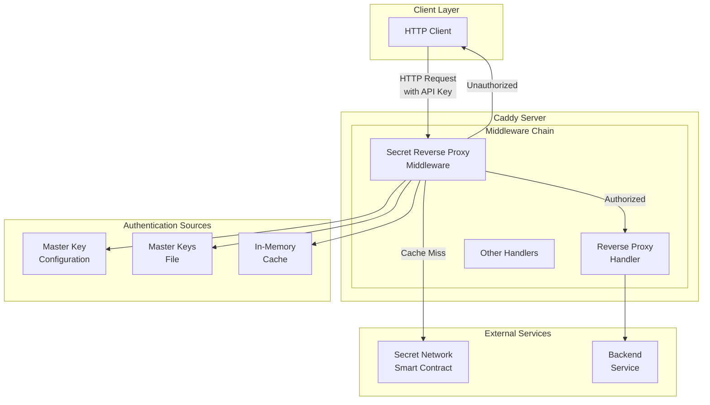
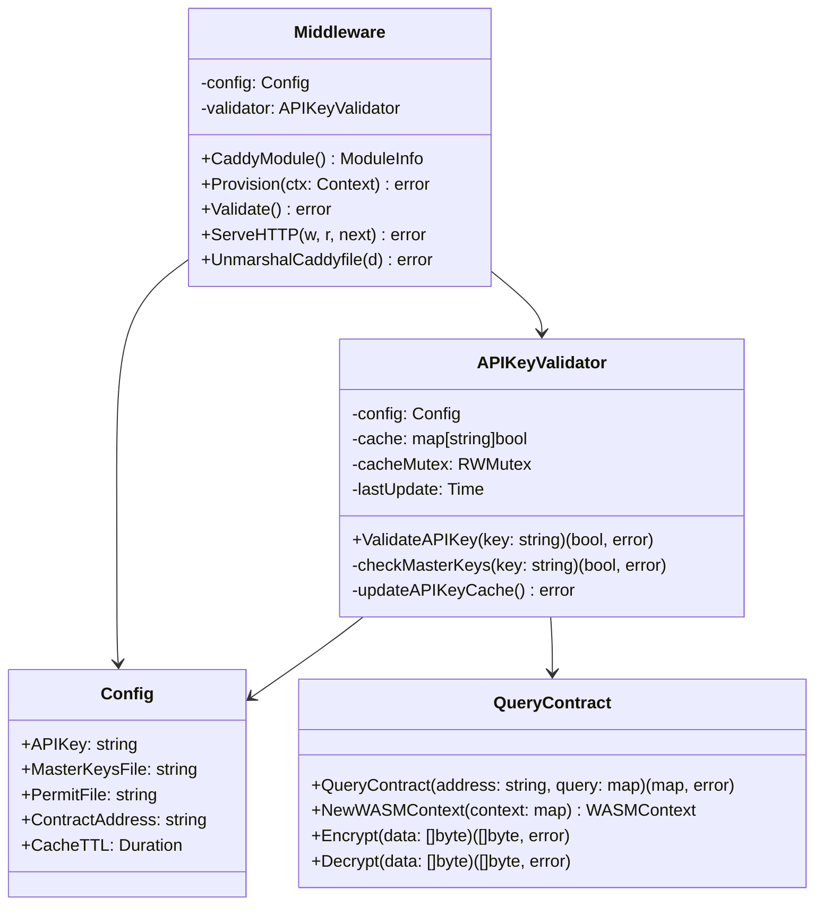
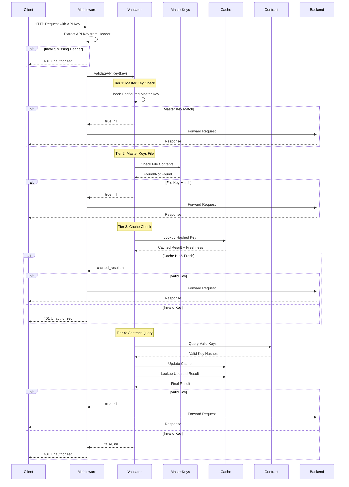
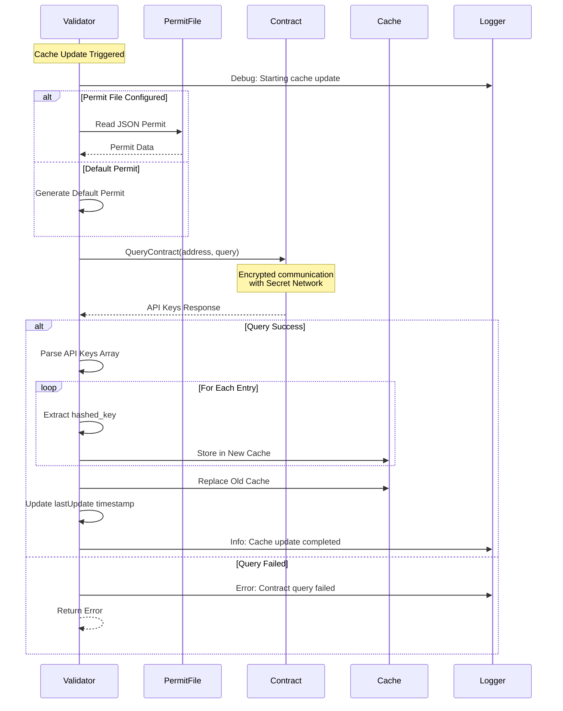
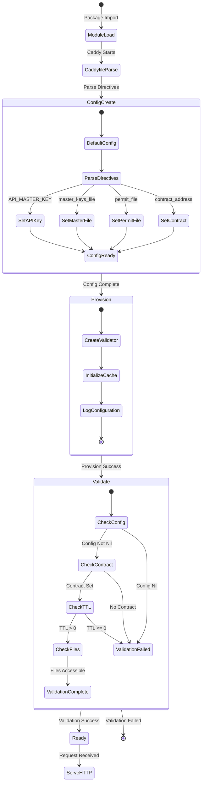
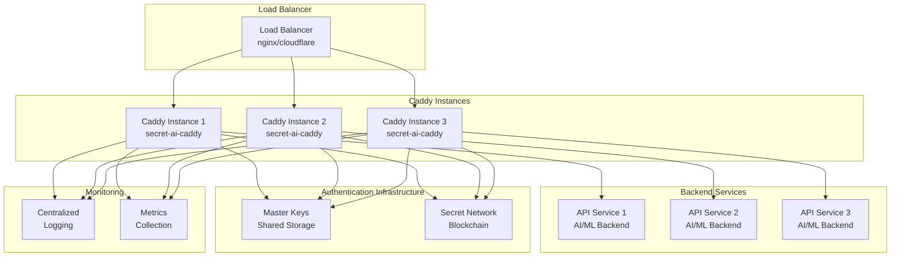

# Secret AI Caddy - Architecture Documentation

## Overview

The Secret AI Caddy is a Caddy middleware that provides API key authentication for reverse proxy operations. It validates API keys against multiple sources including local master keys, file-based keys, and Secret Network smart contracts with performance-optimized caching.

## High-Level Architecture

## Module Structure

## Component Responsibilities

### Middleware
- **Primary Role**: HTTP request interception and authentication
- **Responsibilities**:
  - Extract API keys from Authorization headers
  - Delegate validation to APIKeyValidator
  - Allow/deny requests based on validation results
  - Integration with Caddy's module system

### Config
- **Primary Role**: Configuration management
- **Responsibilities**:
  - Store all configurable parameters
  - Provide default values
  - Support Caddyfile parsing

### APIKeyValidator
- **Primary Role**: Core authentication logic
- **Responsibilities**:
  - Multi-tier API key validation
  - Cache management for performance
  - Integration with Secret Network
  - Thread-safe operations

### QueryContract
- **Primary Role**: Secret Network integration
- **Responsibilities**:
  - Encrypted communication with smart contracts
  - Key derivation and cryptographic operations
  - Blockchain query execution

## Authentication Flow Sequence

## Cache Update Flow

## Configuration and Initialization

## Deployment Architecture

## Security Architecture

```mermaid
graph TB
    subgraph "Security Layers"
        subgraph "Transport Security"
            TLS[TLS 1.3<br/>Certificate Management]
        end
        
        subgraph "Authentication Layer"
            API[API Key<br/>Authentication]
            MFA[Multi-Factor<br/>Sources]
        end
        
        subgraph "Authorization Layer"
            RBAC[Role-Based<br/>Access Control]
            Rate[Rate<br/>Limiting]
        end
        
        subgraph "Data Protection"
            Hash[Key<br/>Hashing]
            Encrypt[Blockchain<br/>Encryption]
            Log[Secure<br/>Logging]
        end
    end
    
    subgraph "Threat Mitigation"
        subgraph "Input Validation"
            Header[Header<br/>Validation]
            Format[Format<br/>Checking]
        end
        
        subgraph "Attack Prevention"
            Replay[Replay<br/>Protection]
            Injection[Injection<br/>Prevention]
        end
        
        subgraph "Monitoring"
            Audit[Audit<br/>Trail]
            Alert[Security<br/>Alerts]
        end
    end
    
    TLS --> API
    API --> MFA
    MFA --> RBAC
    RBAC --> Rate
    Rate --> Hash
    Hash --> Encrypt
    Encrypt --> Log
    
    Header --> Format
    Format --> Replay
    Replay --> Injection
    Injection --> Audit
    Audit --> Alert
```

## Performance Characteristics

### Cache Performance
- **Cache Hit Ratio**: ~95% for stable API key sets
- **Cache TTL**: 30 minutes (configurable)
- **Memory Usage**: ~1KB per 1000 cached keys
- **Lookup Time**: O(1) hash table lookup

### Request Latency
- **Cache Hit**: <1ms additional latency
- **Master Key**: <0.1ms additional latency
- **File Check**: 1-5ms (depends on file size)
- **Contract Query**: 100-500ms (network dependent)

### Throughput
- **Max RPS**: Limited by contract query rate
- **Recommended**: Cache hit ratio >90% for production
- **Scaling**: Horizontal scaling supported

## Monitoring and Observability

### Key Metrics
- Authentication success/failure rates
- Cache hit/miss ratios
- Contract query frequency and latency
- Error rates by authentication tier

### Logging Levels
- **DEBUG**: Request processing details
- **INFO**: Authentication events, cache updates
- **WARN**: Configuration issues, file access problems
- **ERROR**: Authentication failures, system errors

### Health Checks
- Configuration validation status
- Master keys file accessibility
- Contract connectivity
- Cache freshness