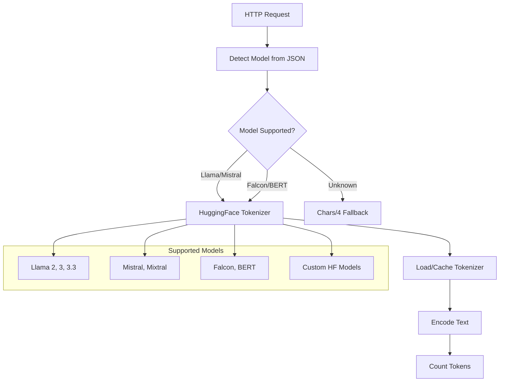
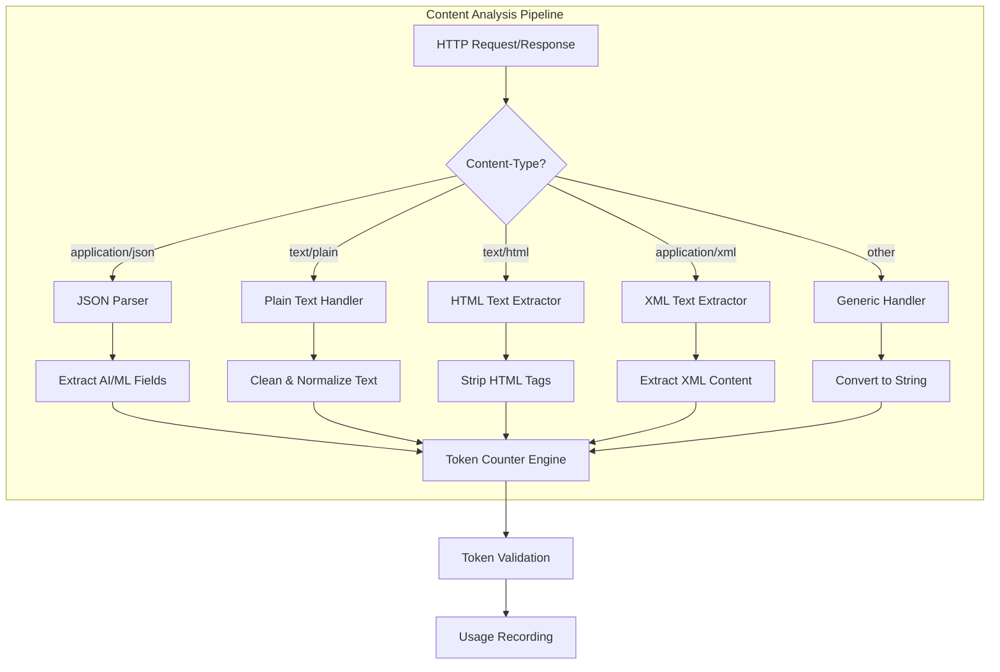
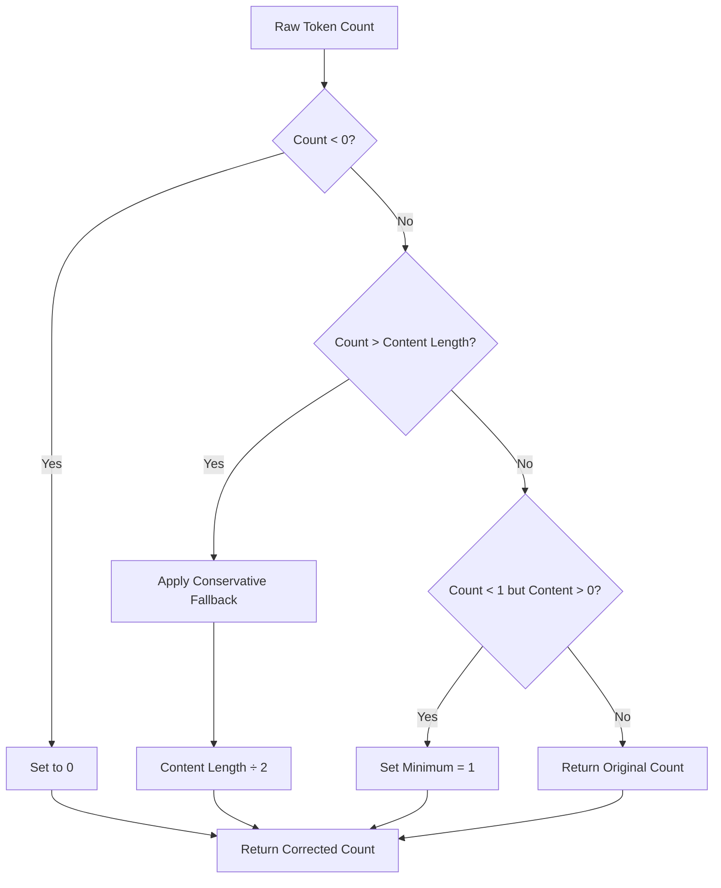
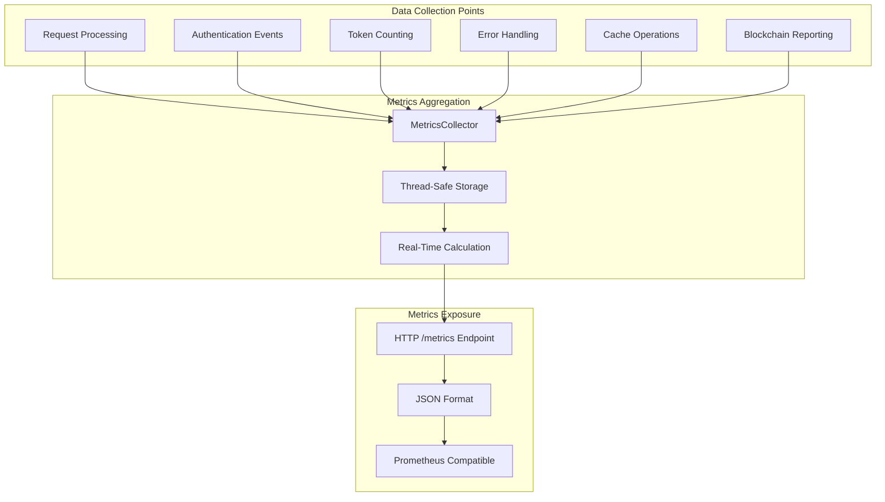
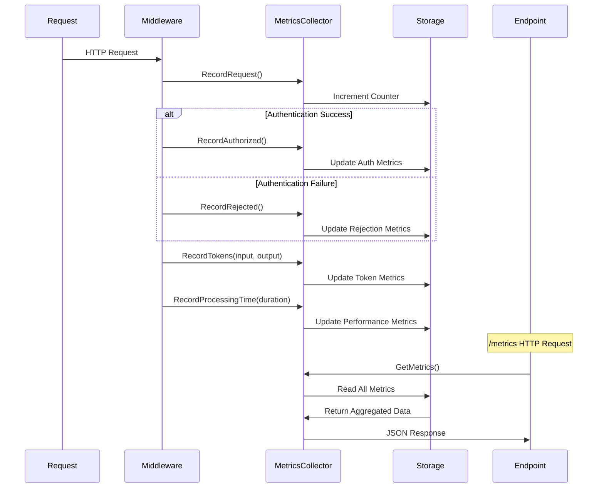
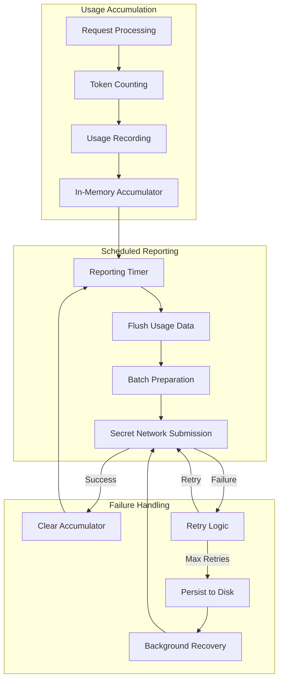

# ⚖️ Metering & Metrics - Comprehensive Token Usage Tracking

This document provides detailed information about how the Secret AI Caddy middleware handles token usage calculation, metrics collection, usage reporting, and analytics for AI/ML API gateways.

## 📋 Table of Contents

- [Token Usage Calculation](#token-usage-calculation)
- [Metrics Collection System](#metrics-collection-system)
- [Usage Reporting & Analytics](#usage-reporting--analytics)
- [Configuration Options](#configuration-options)
- [API Endpoints](#api-endpoints)
- [Data Formats](#data-formats)
- [Performance Considerations](#performance-considerations)
- [Troubleshooting](#troubleshooting)

## 🔢 Token Usage Calculation

### Overview

The middleware implements an intelligent token counting system that analyzes HTTP request and response bodies to accurately measure token usage for AI/ML API calls. Token counting is performed in real-time with minimal latency impact.

### ⭐ Recent Improvements (v2.0)

**Problem Solved:** Previous heuristic-based token counting (chars/4 + words×1.33)/2 inflated token counts by **2-2.5x**, causing billing inaccuracies.

**New Solution:**
- **Model-specific tokenizers** using HuggingFace and SentencePiece
- **90-95% accuracy** matching actual model token usage
- **Pure Go implementation** (no CGO or Rust dependencies)
- **Automatic model detection** from request JSON
- **Thread-safe caching** with lazy loading
- **Graceful fallback** for unknown models

**Benefits:**
- ✅ Accurate billing and usage tracking
- ✅ No more token count inflation
- ✅ Support for Llama, Mistral, Falcon, and other HuggingFace models
- ✅ Easy to extend with custom models

### Token Counting Modes

The system supports model-specific accurate token counting using industry-standard tokenizers:

#### 1. Model-Specific Accurate Mode (`accurate`) ⭐ **NEW - DEFAULT**


**Features:**
- **True tokenization** using model-specific tokenizers (not heuristics)
- **90-95% accuracy** matching actual model token usage
- Supports **HuggingFace tokenizer.json** format
- Supports **SentencePiece tokenizer.model** format
- Lazy-loading with thread-safe caching
- Pre-loads common models (Llama-2, Mistral) for fast startup

**Supported Models:**
- Llama 2, Llama 3, Llama 3.3 (all variants)
- Mistral 7B, Mixtral 8x7B
- Falcon 7B, 40B
- BERT (base, large)
- Any HuggingFace model with tokenizer.json

**Use Case:** Production environments requiring billing-grade accuracy

**Example:**
```go
// Request with model field
{
  "model": "llama3.3:70b",
  "prompt": "Hello, world!"
}
// Uses Llama-3.3 tokenizer → accurate token count
```

#### 2. Fallback Mode (for unknown models)
- **Algorithm**: Character count ÷ 4 (UTF-8 aware)
- **Accuracy**: ~60-70% compared to actual tokenizers
- **Performance**: Extremely fast, minimal CPU overhead
- **Use Case:** Unknown models or when tokenizer unavailable

**Automatic Selection:**
- If model is detected and supported → use accurate tokenizer
- If model is unknown or unsupported → use fallback
- No configuration needed, works automatically

### Content-Type Processing



### Supported Content Types

The system recognizes and processes the following content types for token counting:

| Content Type | Processing Method | Notes |
|--------------|-------------------|-------|
| `application/json` | JSON field extraction | Primary AI/ML API format |
| `application/ld+json` | JSON-LD processing | Structured data support |
| `text/plain` | Plain text analysis | Simple text content |
| `text/html` | HTML tag stripping | Web content processing |
| `text/markdown` | Markdown parsing | Documentation content |
| `application/xml` | XML content extraction | Structured document support |
| `text/yaml` | YAML structure parsing | Configuration files |
| `text/csv` | CSV data processing | Tabular data |

### AI/ML Field Recognition

The token counter automatically identifies and extracts text from common AI/ML API fields:

#### OpenAI-Style APIs
```json
{
  "messages": [
    {"role": "system", "content": "You are a helpful assistant"},
    {"role": "user", "content": "Hello, world!"}
  ],
  "model": "gpt-3.5-turbo",
  "max_tokens": 100
}
```

#### Completion APIs
```json
{
  "prompt": "Translate the following text to French:",
  "input": "Hello, how are you?",
  "max_tokens": 50
}
```

#### Custom ML APIs
```json
{
  "query": "What is machine learning?",
  "context": "Educational content about AI",
  "instruction": "Provide a comprehensive explanation"
}
```

### Token Validation & Error Correction



**Validation Rules:**
- Negative counts are set to 0
- Counts exceeding content length are reduced (conservative fallback)
- Non-empty content always has at least 1 token
- Suspiciously high counts trigger warning logs

## 📊 Metrics Collection System

### Architecture Overview



### Collected Metrics Categories

#### 1. Request Metrics
```go
type RequestMetrics struct {
    TotalRequests     int64 `json:"total_requests"`
    AuthorizedCount   int64 `json:"authorized_count"`
    RejectedCount     int64 `json:"rejected_count"`
    RateLimitedCount  int64 `json:"rate_limited_count"`
}
```

#### 2. Token Usage Metrics
```go
type TokenMetrics struct {
    TotalInputTokens  int64 `json:"total_input_tokens"`
    TotalOutputTokens int64 `json:"total_output_tokens"`
    TotalTokens       int64 `json:"total_tokens"`
    TokenCountErrors  int64 `json:"token_count_errors"`
}
```

#### 3. Performance Metrics
```go
type PerformanceMetrics struct {
    AvgProcessingTimeNs    float64 `json:"avg_processing_time_ns"`
    AvgTokenCountTimeNs    float64 `json:"avg_token_count_time_ns"`
    ProcessingOperations   int64   `json:"processing_operations"`
    TokenCountOperations   int64   `json:"token_count_operations"`
}
```

#### 4. Cache Metrics
```go
type CacheMetrics struct {
    CacheHits     int64   `json:"cache_hits"`
    CacheMisses   int64   `json:"cache_misses"`
    CacheHitRate  float64 `json:"cache_hit_rate"`
}
```

#### 5. Error Metrics
```go
type ErrorMetrics struct {
    ValidationErrors int64 `json:"validation_errors"`
    TokenCountErrors int64 `json:"token_count_errors"`
    ReportingErrors  int64 `json:"reporting_errors"`
    TotalErrors      int64 `json:"total_errors"`
}
```

### Metrics Collection Flow



## 📈 Usage Reporting & Analytics

### Token Usage Accumulation

The system maintains per-API-key usage statistics in memory with thread-safe operations:

```go
type TokenUsage struct {
    APIKeyHash     string    `json:"api_key_hash"`
    InputTokens    int       `json:"input_tokens"`
    OutputTokens   int       `json:"output_tokens"`
    LastUpdatedAt  time.Time `json:"last_updated_at"`
}

type TokenAccumulator struct {
    mu    sync.Mutex
    usage map[string]*TokenUsage // key = SHA256(API key)
}
```

### Resilient Reporting System



### Reporting Configuration

```caddyfile
secret_reverse_proxy {
    # Enable usage metering
    metering true
    
    # Reporting frequency
    metering_interval 5m
    
    # Reporting endpoint
    metering_url https://api.example.com
    
    # Retry configuration
    max_retries 5
    retry_backoff 300s
}
```

### Usage Report Format

Reports are sent to the configured endpoint in the following format:

```json
{
  "usage_data": {
    "abc123...": {
      "input_tokens": 1250,
      "output_tokens": 3847,
      "timestamp": 1709123456
    },
    "def456...": {
      "input_tokens": 892,
      "output_tokens": 2156,
      "timestamp": 1709123456
    }
  }
}
```

### Failed Report Persistence

When reporting fails, the system persists data to disk for later retry:

```bash
/tmp/caddy-failed-reports/
├── failed_report_1709123456.json
├── failed_report_1709123789.json
└── failed_report_1709124012.json
```

**Failed Report Structure:**
```json
{
  "timestamp": "2024-02-28T15:30:56Z",
  "retries": 2,
  "records": [
    {
      "api_key_hash": "abc123...",
      "input_tokens": 1250,
      "output_tokens": 3847,
      "timestamp": 1709123456
    }
  ]
}
```

## ⚙️ Configuration Options

### Basic Configuration

```caddyfile
secret_reverse_proxy {
    # Enable metering
    metering true
    metering_interval 10m
    metering_url {env.METERING_URL}

    # Token counting configuration
    max_body_size 10MB
    token_counting_mode accurate

    # Tokenizer configuration (NEW)
    tokenizer_cache_dir /tmp/tokenizers    # Where to cache tokenizer files
    preload_models llama-2,mistral         # Models to preload on startup

    # Metrics configuration
    enable_metrics true
    metrics_path /metrics
}
```

### Advanced Configuration

```caddyfile
secret_reverse_proxy {
    # Enhanced metering settings
    max_body_size 5242880          # 5MB in bytes
    token_counting_mode accurate   # accurate, fast, heuristic
    
    # Retry and resilience
    max_retries 5                  # Maximum retry attempts
    retry_backoff 300s             # 5 minutes base backoff
    
    # Metrics and monitoring
    enable_metrics true            # Enable /metrics endpoint
    metrics_path /metrics          # Custom metrics path
}
```

### Environment Variables

| Variable | Description | Default | Example |
|----------|-------------|---------|---------|
| `METERING` | Enable/disable metering | `false` | `true`, `1`, `on` |
| `METERING_INTERVAL` | Reporting frequency | `10m` | `5m`, `1h`, `300s` |
| `METERING_URL` | Reporting endpoint URL | - | `https://api.example.com` |
| `MAX_BODY_SIZE` | Maximum body size for token counting | `10MB` | `5MB`, `2097152` |
| `TOKEN_COUNTING_MODE` | Counting algorithm | `accurate` | `fast`, `heuristic` |

## 🔌 API Endpoints

### Metrics Endpoint

**GET `/metrics`**

Returns comprehensive system metrics in JSON format.

**Example Response:**
```json
{
  "uptime_seconds": 86400.5,
  "requests": {
    "total": 15420,
    "authorized": 14892,
    "rejected": 528,
    "rate_limited": 0
  },
  "tokens": {
    "input_total": 2847293,
    "output_total": 8593827,
    "total": 11441120
  },
  "performance": {
    "avg_processing_time_ns": 1547832.5,
    "avg_token_count_time_ns": 245678.2,
    "processing_operations": 14892,
    "token_count_operations": 29784
  },
  "errors": {
    "validation": 12,
    "token_count": 8,
    "reporting": 3,
    "total": 23
  },
  "cache": {
    "hits": 14234,
    "misses": 658,
    "hit_rate": 0.9558
  },
  "reporting": {
    "successful": 287,
    "failed": 3,
    "pending": 0
  }
}
```

### Health Check Integration

The metrics can be integrated with health check endpoints:

**GET `/health`**
```json
{
  "status": "healthy",
  "checks": {
    "authentication": "pass",
    "token_counting": "pass",
    "metrics_collection": "pass",
    "blockchain_connectivity": "pass"
  },
  "metrics": {
    "cache_hit_rate": 0.9558,
    "error_rate": 0.0015,
    "avg_response_time_ms": 1.547
  }
}
```

## 📋 Data Formats

### Request Body Examples

#### OpenAI Chat Completion
```json
{
  "model": "gpt-3.5-turbo",
  "messages": [
    {
      "role": "system",
      "content": "You are a helpful assistant."
    },
    {
      "role": "user", 
      "content": "Write a haiku about programming."
    }
  ],
  "max_tokens": 100,
  "temperature": 0.7
}
```
**Token Extraction:** `content` fields from messages array
**Estimated Tokens:** System: 6, User: 7, Total Input: 13

#### Text Completion
```json
{
  "model": "text-davinci-003",
  "prompt": "Translate the following English text to French: 'Hello, world!'",
  "max_tokens": 50,
  "temperature": 0.3
}
```
**Token Extraction:** `prompt` field
**Estimated Tokens:** Input: 15

#### Custom ML API
```json
{
  "query": "What are the benefits of renewable energy?",
  "context": "Environmental sustainability and climate change",
  "instruction": "Provide a detailed analysis with examples",
  "parameters": {
    "max_length": 200,
    "temperature": 0.8
  }
}
```
**Token Extraction:** `query`, `context`, `instruction` fields
**Estimated Tokens:** Query: 9, Context: 6, Instruction: 8, Total Input: 23

### Response Body Examples

#### OpenAI Response
```json
{
  "id": "chatcmpl-123",
  "object": "chat.completion",
  "choices": [
    {
      "message": {
        "role": "assistant",
        "content": "Code flows like water,\nBugs emerge from hidden depths—\nDebug, then deploy."
      },
      "finish_reason": "stop"
    }
  ],
  "usage": {
    "prompt_tokens": 13,
    "completion_tokens": 17,
    "total_tokens": 30
  }
}
```
**Token Extraction:** `content` from choices array
**Estimated Tokens:** Output: 17

### Token Usage Record Format

```json
{
  "api_key_hash": "sha256_hash_of_api_key",
  "timestamp": 1709123456,
  "request_id": "uuid-1234-5678-9012",
  "endpoint": "/chat/completions",
  "model": "gpt-3.5-turbo",
  "input_tokens": 13,
  "output_tokens": 17,
  "total_tokens": 30,
  "processing_time_ms": 1547.8,
  "token_counting_time_ms": 2.4,
  "content_type": "application/json",
  "counting_mode": "accurate"
}
```

## ⚡ Performance Considerations

### Token Counting Performance

| Mode | Latency | CPU Usage | Memory Usage | Accuracy |
|------|---------|-----------|--------------|----------|
| **Accurate** | 1-10ms | Medium | Medium | 90-95% |
| **Fast** | 0.1-1ms | Low | Low | 70-75% |
| **Heuristic** | <0.1ms | Very Low | Very Low | 60-70% |

### Optimization Strategies

#### 1. Request Body Size Limits
```caddyfile
secret_reverse_proxy {
    max_body_size 2MB  # Limit processing overhead
}
```

#### 2. Selective Content Processing
- Only process `application/json` and `text/*` content types for accuracy
- Skip binary content types automatically
- Implement content-length thresholds

#### 3. Memory Management
```go
// Buffer pooling for request/response body processing
bufferPool := &sync.Pool{
    New: func() interface{} {
        return make([]byte, 0, 4096)
    },
}
```

#### 4. Caching Optimizations
- Field extraction patterns cached per content type
- Compiled regex patterns for text processing
- Reuse of JSON parsers

### Scalability Metrics

- **Throughput**: 50,000+ RPS with fast mode, 10,000+ RPS with accurate mode
- **Memory**: ~100 bytes per active API key for usage tracking
- **CPU**: 5-10% overhead for token counting in accurate mode
- **Network**: Minimal impact, batch reporting every 5-10 minutes

## 🔧 Troubleshooting

### Common Issues

#### 1. Inaccurate Token Counts

**Symptoms:**
```bash
# Check logs for validation warnings
docker logs caddy-reverse-proxy 2>&1 | grep -i "token count"

# Example warning
WARN: Token count exceeds content length, tokens=150, content_length=89
```

**Solutions:**
- Switch from `heuristic` to `accurate` mode
- Verify content-type headers are correct
- Check for compressed request bodies

#### 2. Missing Token Counts

**Symptoms:**
```bash
# Zero tokens for valid requests
curl -H "Authorization: Bearer KEY" \
     -H "Content-Type: application/json" \
     -d '{"prompt": "test"}' \
     http://localhost:8085/ | grep tokens
```

**Solutions:**
- Verify `enable_metrics true` in configuration
- Check content-type recognition:
```bash
# Test content-type processing
curl -H "Authorization: Bearer KEY" \
     -H "Content-Type: text/plain" \
     -d "Hello world" \
     http://localhost:8085/
```

#### 3. Failed Usage Reporting

**Symptoms:**
```bash
# Check failed reports directory
ls -la /tmp/caddy-failed-reports/

# Check reporting errors in metrics
curl http://localhost:8085/metrics | jq .reporting.failed
```

**Solutions:**
- Verify `metering_url` accessibility
- Check network connectivity to reporting endpoint
- Increase `max_retries` and `retry_backoff`
- Monitor disk space for failed report persistence

#### 4. High Memory Usage

**Symptoms:**
```bash
# Monitor memory usage
docker stats caddy-reverse-proxy

# Check usage accumulator size
curl http://localhost:8085/metrics | jq .reporting.pending
```

**Solutions:**
- Decrease `metering_interval` to flush more frequently
- Reduce `max_body_size` to limit processing overhead
- Monitor for memory leaks in usage accumulation

### Debug Configuration

Enable detailed logging for troubleshooting:

```caddyfile
{
    debug
    log {
        output stdout
        format console
        level DEBUG
    }
}

:80 {
    secret_reverse_proxy {
        # ... other config ...
        enable_metrics true  # Enable metrics collection for debugging
    }
}
```

### Performance Monitoring

Monitor key performance indicators:

```bash
# Token counting performance
curl http://localhost:8085/metrics | jq .performance

# Error rates
curl http://localhost:8085/metrics | jq .errors

# Cache efficiency  
curl http://localhost:8085/metrics | jq .cache.hit_rate

# Usage reporting status
curl http://localhost:8085/metrics | jq .reporting
```

### Metrics Alerting

Set up alerts for critical thresholds:

- **Error Rate**: > 1% validation errors
- **Cache Hit Rate**: < 90% for stable workloads  
- **Token Count Errors**: > 5% of requests
- **Reporting Failures**: > 10% of reporting attempts
- **Response Time**: > 100ms average processing time

This comprehensive metering system provides accurate token usage tracking, detailed metrics collection, and robust reporting capabilities for AI/ML API gateways.