# Verifiable Message Signing - Design Document

## Document Information

| Field            | Value                |
| ---------------- | -------------------- |
| **Version**      | 1.0                  |
| **Status**       | Draft                |
| **Last Updated** | January 2025         |
| **Authors**      | ScrtLabs Engineering |

---

## Table of Contents

1. [Executive Summary](#1-executive-summary)
2. [Background & Motivation](#2-background--motivation)
3. [System Architecture](#3-system-architecture)
4. [Functional Requirements](#4-functional-requirements)
5. [Configuration Reference](#5-configuration-reference)
6. [Data Flow & Processing](#6-data-flow--processing)
7. [API Specification](#7-api-specification)
8. [Error Handling](#8-error-handling)
9. [Security Considerations](#9-security-considerations)
10. [Metrics & Observability](#10-metrics--observability)
11. [Implementation Plan](#11-implementation-plan)

---

## 1. Executive Summary

### 1.1 Purpose

This document describes the design for adding **Verifiable Message Signing** capability to the Secret Reverse Proxy Caddy middleware. This feature enables cryptographic signing of LLM request/response pairs using keys secured within a SecretVM Trusted Execution Environment (TEE), providing verifiable proof that AI-generated content originated from a genuine, attested compute environment.

### 1.2 Scope

The signing functionality will be integrated as an extension to the existing `secret_reverse_proxy` Caddy middleware module, leveraging:

- Existing request/response body capture (used for token metering)
- Existing configuration infrastructure (Caddyfile parsing)
- Existing metrics collection system
- SecretVM Signing Server running within the same TEE

### 1.3 Key Features

| Feature                         | Description                                                           |
| ------------------------------- | --------------------------------------------------------------------- |
| **Prompt & Completion Signing** | Signs SHA256 hashes of extracted prompt and completion text           |
| **TEE-Backed Keys**             | Private keys never leave the SecretVM enclave                         |
| **Configurable Paths**          | Sign only specific API endpoints (e.g., `/api/generate`, `/api/chat`) |
| **Graceful Degradation**        | Returns unsigned responses if signing fails                           |
| **Multiple Algorithms**         | Supports `secp256k1` and `ed25519` signing algorithms                 |
| **Response Headers**            | Signature and metadata returned via HTTP headers                      |

---

## 2. Background & Motivation

### 2.1 Problem Statement

As AI-generated content becomes increasingly prevalent, there is a growing need to:

1. **Prove Authenticity**: Verify that content was generated by a specific, trusted AI system
2. **Ensure Integrity**: Detect any tampering with prompts or responses
3. **Enable Auditability**: Create a verifiable chain of custody for AI interactions
4. **Support Compliance**: Meet regulatory requirements for AI transparency

### 2.2 Solution Overview

By integrating with SecretVM's Verifiable Message Signing capability, we can:

- Generate cryptographic signatures for each LLM interaction
- Prove signatures originated from a genuine TEE via remote attestation
- Provide third-party verifiable proof without exposing private keys

### 2.3 SecretVM Signing Server

The SecretVM platform provides a signing server that:

- Runs at `http://172.17.0.1:49153` (internal Docker network only)
- Holds private keys generated within the TEE
- Provides attestation quotes binding public keys to the TEE environment
- Supports `secp256k1` and `ed25519` algorithms

---

## 3. System Architecture

### 3.1 High-Level Architecture

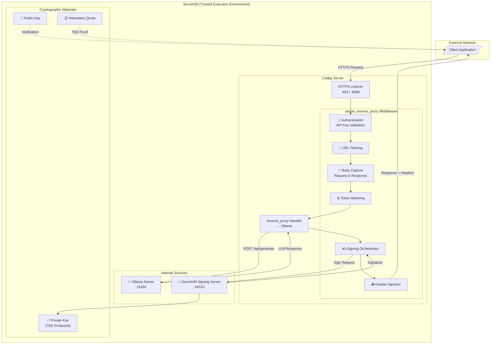

### 3.2 Middleware Component Architecture

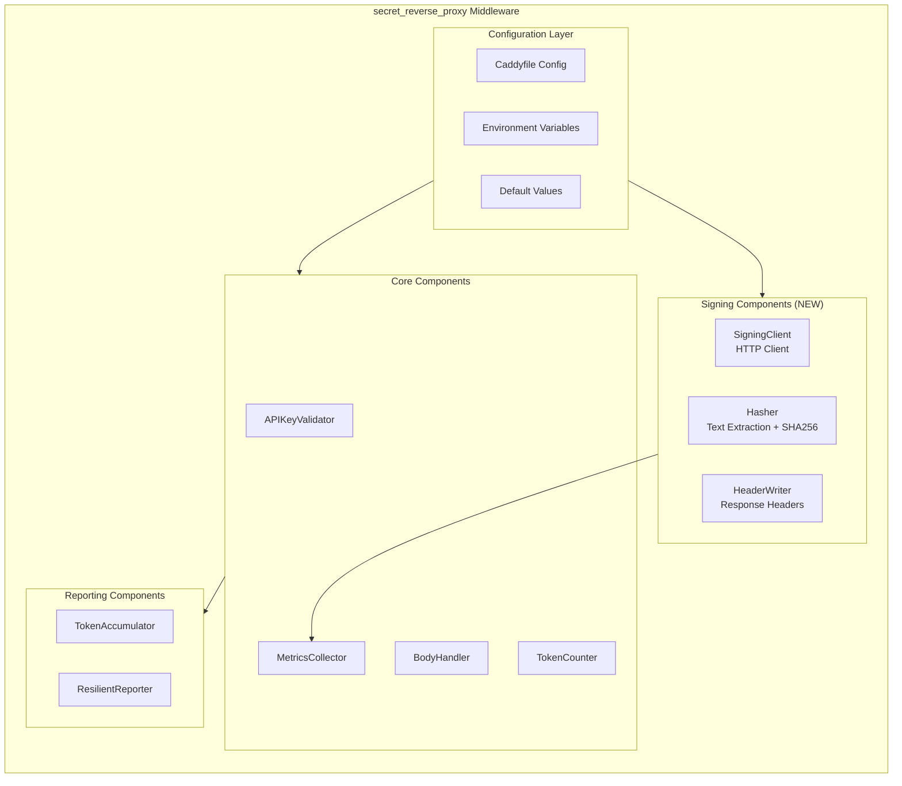

### 3.3 Package Structure

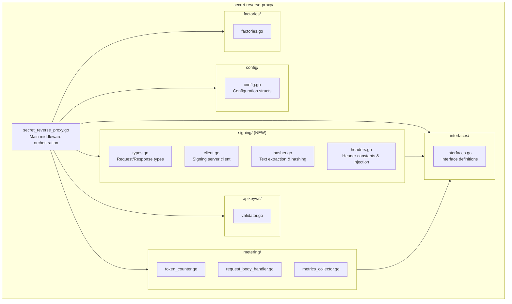

---

## 4. Functional Requirements

### 4.1 Core Signing Functionality

| ID    | Requirement                                         | Priority    |
| ----- | --------------------------------------------------- | ----------- |
| FR-01 | Extract prompt text from JSON request body          | Must Have   |
| FR-02 | Extract completion text from JSON response body     | Must Have   |
| FR-03 | Compute SHA256 hash of prompt and completion        | Must Have   |
| FR-04 | Build signing payload with hashes and timestamp     | Must Have   |
| FR-05 | Send signing request to SecretVM Signing Server     | Must Have   |
| FR-06 | Inject signature and metadata into response headers | Must Have   |
| FR-07 | Support configurable list of paths to sign          | Must Have   |
| FR-08 | Support `secp256k1` and `ed25519` algorithms        | Must Have   |
| FR-09 | Gracefully handle signing failures                  | Must Have   |
| FR-10 | Record signing metrics                              | Should Have |

### 4.2 Request Format Support

The signing module must extract text from multiple Ollama/OpenAI request formats:

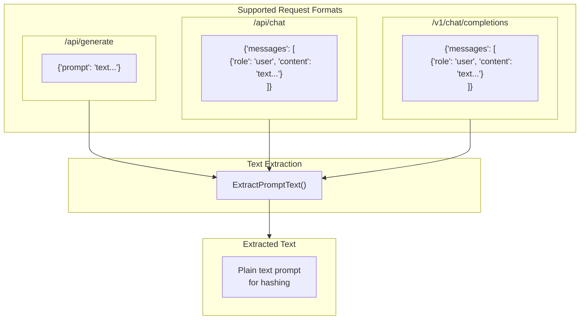

### 4.3 Response Format Support

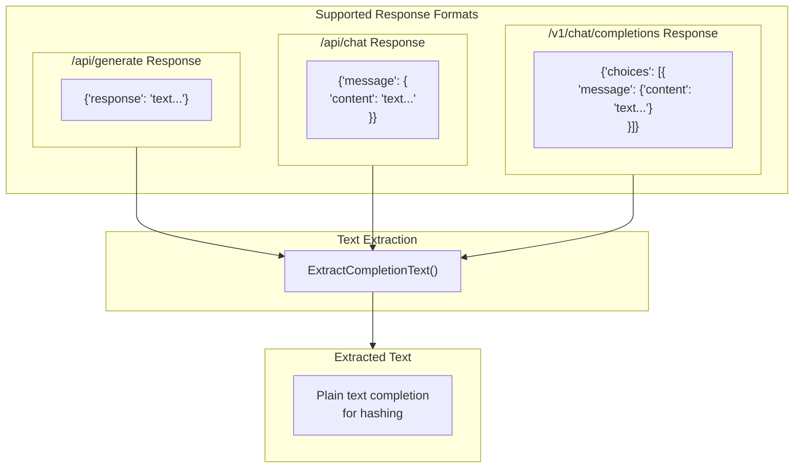

---

## 5. Configuration Reference

### 5.1 Caddyfile Configuration

```caddyfile
# Example Caddyfile with signing configuration
{
    order secret_reverse_proxy before reverse_proxy
}

:8080 {
    secret_reverse_proxy {
        # ============================================
        # Existing Configuration (Authentication & Metering)
        # ============================================
        API_MASTER_KEY              {$API_MASTER_KEY}
        master_keys_file            /etc/caddy/master_keys.txt
        permit_file                 /etc/caddy/permit.json
        contract_address            secret18xpp2kmkk7g8xzx24wm5zstw9tjv6g3xle2vjm
        secret_node                 lcd.secret.tactus.starshell.net
        secret_chain_id             secret-4
        cache_ttl                   30m
        
        # Metering configuration
        metering                    true
        metering_interval           60s
        metering_url                https://api.scrtlabs.com/usage
        
        # Metrics configuration
        enable_metrics              true
        metrics_path                /metrics
        
        # ============================================
        # NEW: Signing Configuration
        # ============================================
        signing_enabled             true
        signing_server              http://172.17.0.1:49153
        signing_key_type            secp256k1
        signing_timeout             5s
        signing_paths               /api/generate /api/chat /v1/chat/completions
    }
    
    reverse_proxy localhost:11434
}
```

### 5.2 Configuration Parameters

| Parameter          | Type     | Default                          | Description                                  |
| ------------------ | -------- | -------------------------------- | -------------------------------------------- |
| `signing_enabled`  | boolean  | `false`                          | Enable/disable message signing               |
| `signing_server`   | string   | `http://172.17.0.1:49153`        | URL of SecretVM Signing Server               |
| `signing_key_type` | string   | `secp256k1`                      | Signing algorithm (`secp256k1` or `ed25519`) |
| `signing_timeout`  | duration | `5s`                             | Timeout for signing server requests          |
| `signing_paths`    | []string | `["/api/generate", "/api/chat"]` | URL paths to sign                            |

### 5.3 Environment Variable Support

```bash
# Signing can also be configured via environment variables
export SIGNING_ENABLED=true
export SIGNING_SERVER=http://172.17.0.1:49153
export SIGNING_KEY_TYPE=secp256k1
export SIGNING_TIMEOUT=5s
export SIGNING_PATHS="/api/generate,/api/chat,/v1/chat/completions"
```

### 5.4 Configuration Validation

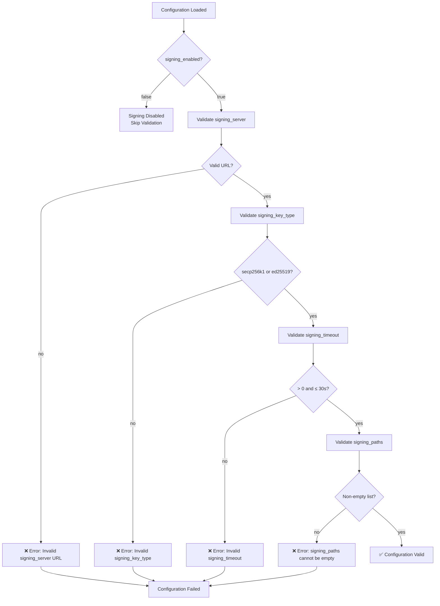

---

## 6. Data Flow & Processing

### 6.1 Complete Request/Response Flow

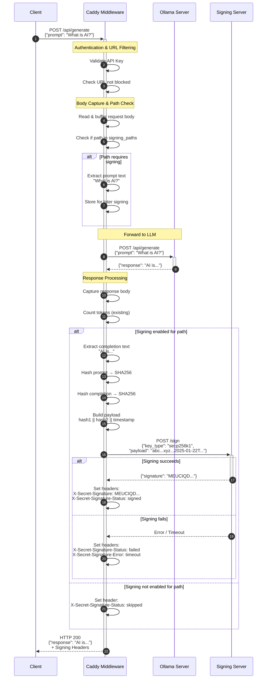

### 6.2 Signing Payload Construction

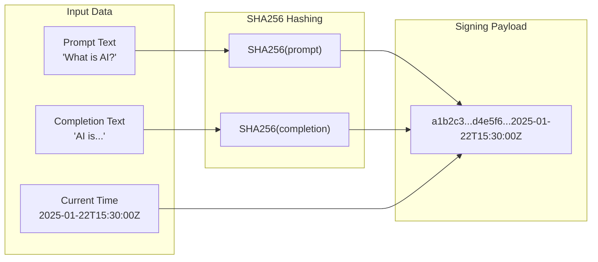

**Payload Format:**
```
{SHA256_HEX(prompt)}{SHA256_HEX(completion)}{RFC3339_TIMESTAMP}
```

**Example:**
```
a1b2c3d4e5f6789012345678901234567890123456789012345678901234abcdd4e5f6a1b2c3789012345678901234567890123456789012345678901234ef012025-01-22T15:30:00Z
```

### 6.3 ServeHTTP Processing Flow

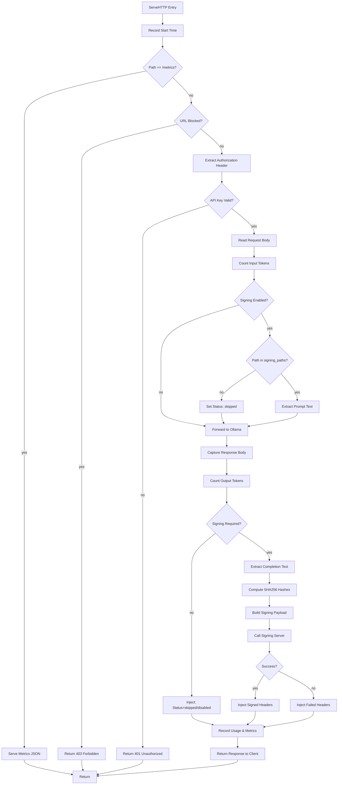

---

## 7. API Specification

### 7.1 Response Headers

#### Successful Signing

| Header                         | Example Value          | Description              |
| ------------------------------ | ---------------------- | ------------------------ |
| `X-Secret-Signature`           | `MEUCIQD4f8s...`       | Base64-encoded signature |
| `X-Secret-Signature-Algo`      | `secp256k1`            | Algorithm used           |
| `X-Secret-Request-Hash`        | `a1b2c3d4e5f6...`      | SHA256 hex of prompt     |
| `X-Secret-Response-Hash`       | `f6e5d4c3b2a1...`      | SHA256 hex of completion |
| `X-Secret-Signature-Timestamp` | `2025-01-22T15:30:00Z` | RFC3339 timestamp        |
| `X-Secret-Signature-Status`    | `signed`               | Status indicator         |

#### Failed Signing

| Header                         | Example Value            | Description              |
| ------------------------------ | ------------------------ | ------------------------ |
| `X-Secret-Request-Hash`        | `a1b2c3d4e5f6...`        | SHA256 hex of prompt     |
| `X-Secret-Response-Hash`       | `f6e5d4c3b2a1...`        | SHA256 hex of completion |
| `X-Secret-Signature-Timestamp` | `2025-01-22T15:30:00Z`   | RFC3339 timestamp        |
| `X-Secret-Signature-Status`    | `failed`                 | Status indicator         |
| `X-Secret-Signature-Error`     | `signing server timeout` | Error description        |

#### Skipped/Disabled

| Header                      | Example Value           | Description      |
| --------------------------- | ----------------------- | ---------------- |
| `X-Secret-Signature-Status` | `skipped` or `disabled` | Status indicator |

### 7.2 Status Values

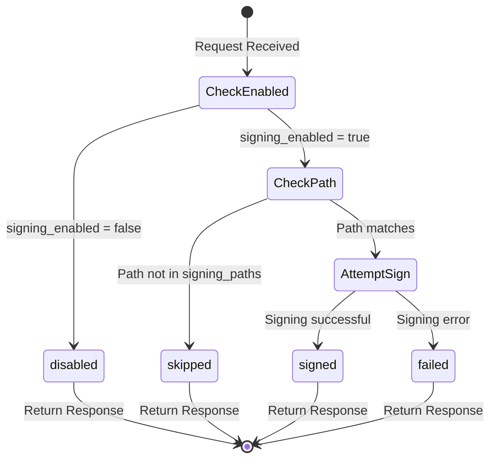

### 7.3 Signing Server API

**Endpoint:** `POST http://172.17.0.1:49153/sign`

**Request:**
```json
{
    "key_type": "secp256k1",
    "payload": "a1b2c3...f6e5d4...2025-01-22T15:30:00Z"
}
```

**Response (Success):**
```json
{
    "signature": "MEUCIQD4f8sKx..."
}
```

**Response (Error):**
```json
{
    "error": "invalid key type"
}
```

---

## 8. Error Handling

### 8.1 Error Scenarios

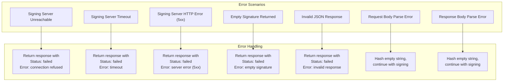

### 8.2 Error Response Matrix

| Error Type                 | HTTP Status    | Response Body     | Signing Headers                               |
| -------------------------- | -------------- | ----------------- | --------------------------------------------- |
| Signing server unreachable | 200 (original) | Original response | `Status: failed`, `Error: connection refused` |
| Signing timeout            | 200 (original) | Original response | `Status: failed`, `Error: timeout`            |
| Invalid signature          | 200 (original) | Original response | `Status: failed`, `Error: invalid signature`  |
| JSON parse error           | 200 (original) | Original response | `Status: failed`, `Error: parse error`        |

### 8.3 Graceful Degradation Principle

> **The LLM response is ALWAYS returned to the client.**
> 
> Signing failures affect only the signing headers, never the primary response.
> This ensures that signing issues do not impact the availability of the AI service.

---

## 9. Security Considerations

### 9.1 Threat Model

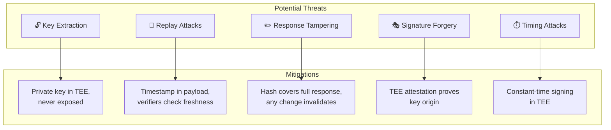

### 9.2 Security Properties

| Property                | Implementation                                                |
| ----------------------- | ------------------------------------------------------------- |
| **Key Confidentiality** | Private key generated and stored within SecretVM TEE          |
| **Non-Repudiation**     | Attestation quote proves key was generated in genuine TEE     |
| **Integrity**           | SHA256 hashes detect any modification to prompt or completion |
| **Freshness**           | Timestamp prevents indefinite replay of signatures            |
| **Algorithm Security**  | secp256k1/ed25519 are industry-standard algorithms            |

### 9.3 Network Security

- Signing server only accessible via internal Docker network (`172.17.0.1`)
- No external network exposure of signing endpoint
- TLS termination at Caddy for external traffic

---

## 10. Metrics & Observability

### 10.1 Signing Metrics

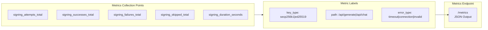

### 10.2 Metrics JSON Output

```json
{
    "signing": {
        "enabled": true,
        "key_type": "secp256k1",
        "attempts_total": 10000,
        "successes_total": 9950,
        "failures_total": 50,
        "skipped_total": 2000,
        "success_rate": 0.995,
        "avg_duration_ms": 12.5,
        "p99_duration_ms": 45.2,
        "failures_by_type": {
            "timeout": 30,
            "connection_refused": 15,
            "invalid_response": 5
        },
        "requests_by_path": {
            "/api/generate": 7000,
            "/api/chat": 3000
        }
    }
}
```

### 10.3 Logging

```
level=INFO msg="Signing request" path=/api/generate key_type=secp256k1 payload_length=140
level=INFO msg="Signing successful" path=/api/generate duration_ms=12 signature_length=96
level=WARN msg="Signing failed" path=/api/generate error="timeout" duration_ms=5000
level=DEBUG msg="Signing skipped" path=/api/tags reason="path not in signing_paths"
```

---

## 11. Implementation Plan

### 11.1 Implementation Phases

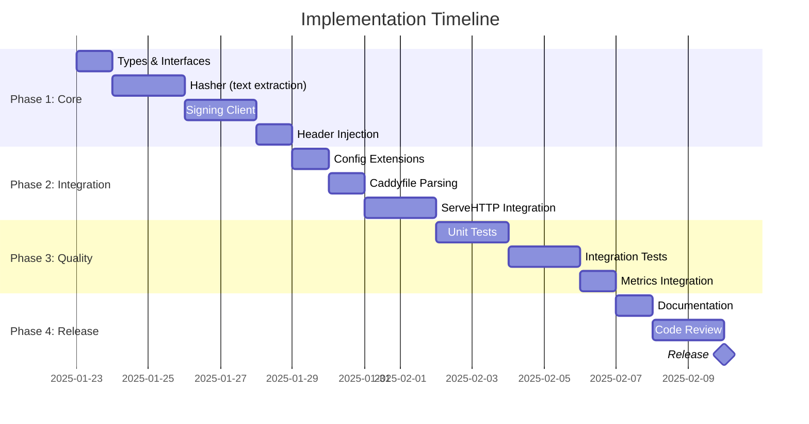

### 11.2 File Changes Summary

| File                            | Change Type | Description                        |
| ------------------------------- | ----------- | ---------------------------------- |
| `config/config.go`              | Modify      | Add signing configuration fields   |
| `interfaces/interfaces.go`      | Modify      | Add SigningClient interface        |
| `signing/types.go`              | **New**     | Request/response type definitions  |
| `signing/hasher.go`             | **New**     | Text extraction and SHA256 hashing |
| `signing/client.go`             | **New**     | HTTP client for signing server     |
| `signing/headers.go`            | **New**     | Header constants and injection     |
| `secret_reverse_proxy.go`       | Modify      | Integrate signing into ServeHTTP   |
| `metering/metrics_collector.go` | Modify      | Add signing metrics                |
| `factories/factories.go`        | Modify      | Add signing component factory      |

### 11.3 Testing Strategy

| Test Type         | Scope                                       | Tools               |
| ----------------- | ------------------------------------------- | ------------------- |
| Unit Tests        | Individual functions (hasher, client)       | Go testing, testify |
| Integration Tests | Full signing flow with mock server          | httptest            |
| End-to-End Tests  | Complete request/response with real signing | Docker Compose      |
| Performance Tests | Signing latency impact                      | Go benchmarks       |

---

## Appendix A: Verification Guide

For clients verifying signatures, the process is:

1. **Obtain attestation quote** from SecretVM (separate endpoint, not through Caddy)
2. **Verify attestation** using Intel/AMD TEE verification services
3. **Extract public key** from verified attestation report data
4. **Reconstruct payload**: `SHA256(prompt) || SHA256(completion) || timestamp`
5. **Verify signature** using public key and reconstructed payload

---

## Appendix B: Glossary

| Term                  | Definition                                               |
| --------------------- | -------------------------------------------------------- |
| **TEE**               | Trusted Execution Environment - hardware-secured enclave |
| **SecretVM**          | Secret Network's confidential VM platform                |
| **Attestation Quote** | Cryptographic proof of TEE environment state             |
| **secp256k1**         | Elliptic curve used in Bitcoin/Ethereum                  |
| **ed25519**           | Edwards-curve Digital Signature Algorithm                |

---

*End of Design Document*