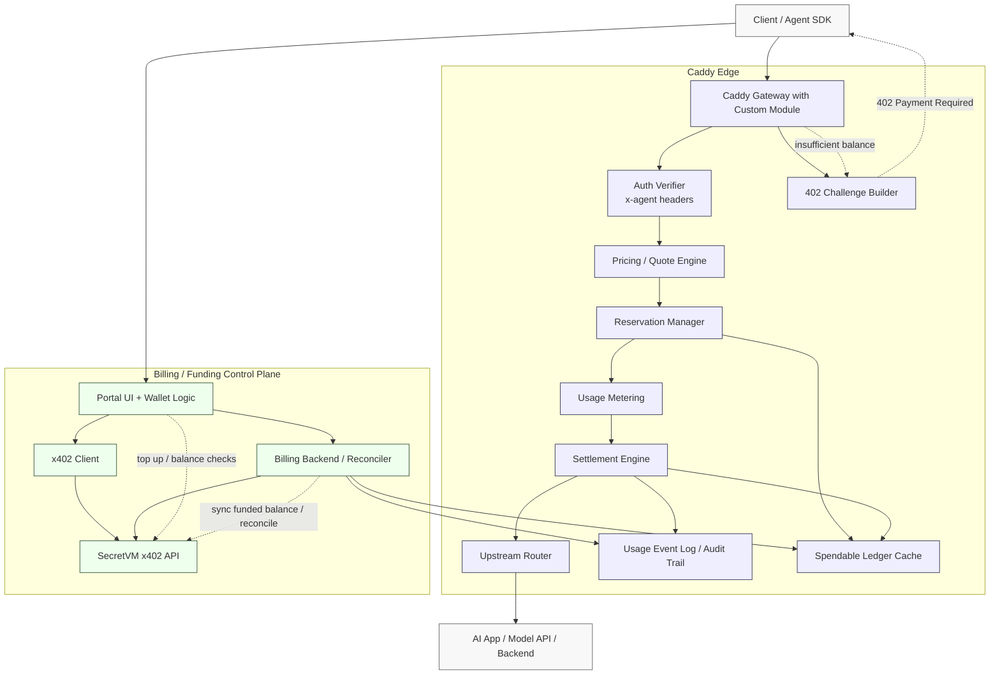
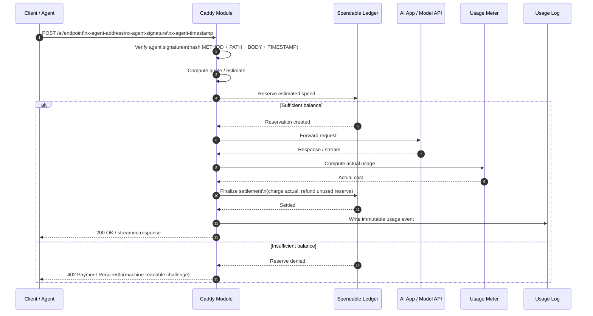
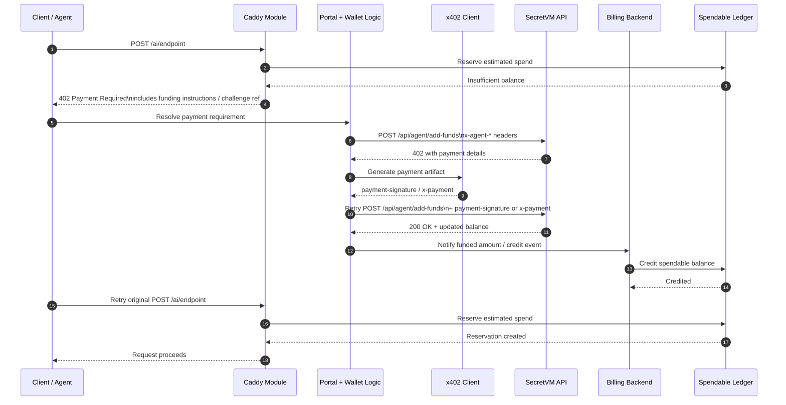
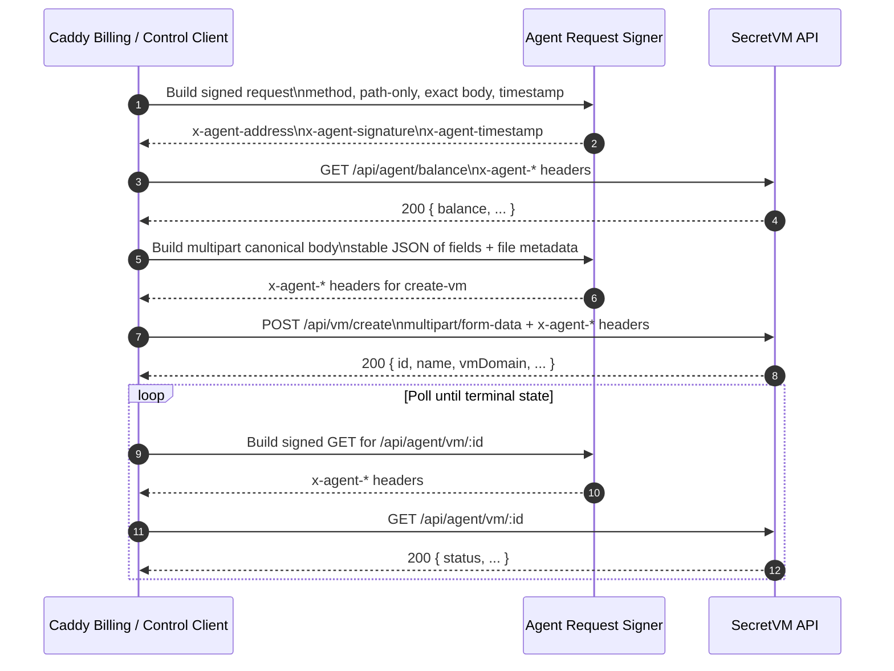
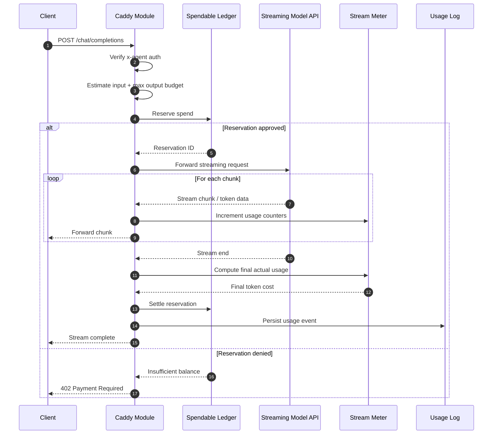

# x402 Support in SecretVM Reverse Proxy

This design document reflects the SecretVM x402 details that matter for a Caddy integration: agent-authenticated calls use x-agent-address, x-agent-signature, and x-agent-timestamp; signatures are based on METHOD + PATH + BODY + TIMESTAMP; POST /api/agent/add-funds can return 402 and then be retried with payment-signature or x-payment; and the standard agent flow is top up → balance → create VM → poll status.  

1) Proposed Caddy architecture for metering and x402 support


> Notes
	•	Portal remains the funding authority and wallet owner.
	•	Caddy handles hot-path enforcement: authenticate, price, reserve, meter, settle.
	•	Spendable ledger cache is the runtime authorization source so Caddy does not need to call SecretVM balance on every request.
	•	Billing backend / reconciler syncs top-ups and reconciles settled usage against SecretVM-backed funds.
	•	402 challenge builder lets Caddy reject underfunded requests cleanly without embedding full wallet UX into the proxy.

2) Sequence diagram: normal metered request through Caddy

This shows the prepaid authorization pattern for AI calls.

This aligns with the SecretVM signing model for agent-authenticated requests, including replay protection expectations tied to fresh timestamps and per-request hashes.  

3) Sequence diagram: x402 top-up flow triggered by a Caddy 402

This is the cleaner split where Caddy does not perform wallet payment itself.

The top-up retry behavior here follows the documented POST /api/agent/add-funds flow: first call may return 402, and the retry includes payment-signature or x-payment.  

4) Sequence diagram: direct SecretVM agent flow from Caddy for balance and VM lifecycle

When the module needs to speak to the SecretVM agent API directly, this shows the call pattern.

This reflects the documented requirements that:
	•	the signed path is the path only, without query string,
	•	the body must match exactly,
	•	JSON should be stable/sorted,
	•	POST /api/vm/create signs a stable JSON representation of form fields plus file metadata rather than raw multipart bytes.  

1) Sequence diagram: streaming AI request with reserve and final settlement

For token-metered AI endpoints, this is usually the most important runtime flow.

Suggested naming inside the Caddy module

For the implementation, we will align the module boundaries with the diagrams:
```
caddy.x402
├── AuthVerifier
├── QuoteEngine
├── ReservationStore
├── SpendableLedger
├── UsageMeter
├── SettlementEngine
├── ChallengeBuilder
├── SecretVMClient
│   ├── BuildAgentHeaders()
│   ├── GetBalance()
│   ├── AddFunds()
│   ├── CreateVM()
│   └── GetVMStatus()
└── Reconciler
```
Most important implementation constraint

Caddy makes SecretVM agent API calls itself, hence need to build signatures from the final outbound request after all mutations. The docs are explicit that the signed payload depends on exact method, exact path, exact body, and a fresh timestamp; replays are rejected.  
